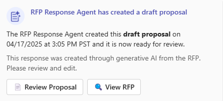

## Demo Script

To see the key capabilities of this accelerator in action after completing the installation, follow the execution step guidance included below.

Note that the steps follow a sequence conducted by the following persona:

**Jennia Lim** is a sales manager at a tech company. Her team is responsible to create proposal responding to Request for Proposals (RFPs) submitted by customers.

Jennia’s goal is to consistently achieve a higher rate of accuracy and efficiency in RFP responses. Jennia aims to create high quality proposals that have a high winning rate, and get customer's acceptance quickly.

She leverages the AI powered RFP response agent to help her to achieve her objectives. The RFP Response agent has the capability of deep reasoning, summarizing requirements, providing quality responses based on a knowledge base that has a collection of accumulated successful RFP responses.

### Execution Steps

1.Send an email to the mailbox you selected in Step 2.3.1.3 of the [deployment readme](GitHubRepo/Deployment/README.md).

2.In the email make sure you have an attachment. You can use the `Fourth Coffee-Explore Azure- AI-Services.docx`  provided in the data folder which is the customer RFP and a product name in the body of the email along with "RFP" in the subject. Here is a sample below for easy copy pasting:

> Hi Jennia,
>
> Following our recent conversation, we are pleased to share the attached RFP document regarding Azure AI Services. The document outlines specific questions and requirements to guide your proposal.
>
> We look forward to reviewing your detailed response and discussing potential next steps.
>
> Thank you,
>  Isaac Talbot

3.After this email is sent, this triggers the agent autonomously where it runs through the metaprompt in it's description and generates the Draft RFP proposal which it posts in MS Teams.

4.Open Microsoft Teams and select the channel you configured to receive the adaptive card from Step 3.2 as pictured below.

5.Click on the Review Proposal button to open up the proposal created by the agent.

6.At this point, before interacting with the proposal, **highlight the business value, automation, autonomous capabilities, deep reasoning, GenAI orchestration and RFP knowledge sources being leveraged to create the proposal. This entire document has been created with NO human interaction and is completely autonomous. This helps sellers already have a draft of the proposal at their fingertips leveraging all the needed organizational knowledge, deep reasoning, GenAI orchestration to end up with a document suited for their customers.**

7.In the proposal document, go over the various sections of proposal, compliance & security best practices, project plan and confidence score.

8.From here, show the Q&A capabilities of the agent. **This can be done in 2 ways. If you have M365 copilot then use the Word copilot and @RFP response agent to interact with the agent. If you do not have M365 copilot then go back to MS Teams and @RFP response agent to interact with the agent in Teams**.

9.Ask a question to the agent to showcase the Q&A functionality. A good sample question would be **"Provide me a comprehensive list of azure services I can include in this RFP"**. The purpose of this is to showcase that not only would the agent draft the proposal based on all it knows and deep reasoning but it can also be used to ask specific questions a user would like to enquire about.

10.Finally, as a good wrap up question to set the tone on how the sellers can collaborate on this proposal going forward and the agent has done it's job of drafting a v1 proposal, ask a question on the lines of **"What are the next 3 actions I should take before submitting this proposal?"**
